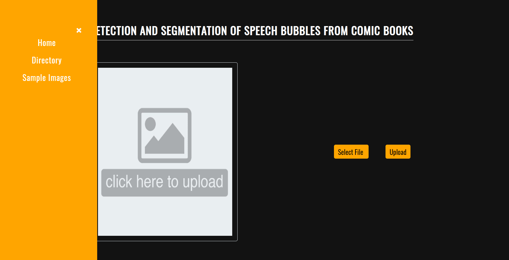

# Detection and Segmentation of Speech Bubbles from Comic Images
Speech Bubbles in comic images are segmented and its text are extracted.

This repository contains the UI part of the project developed using Angular. You can find the server code [here](https://github.com/paarshan4800/comic-bubble-segmentation).


## Setup
- Download and Install [Node.js](https://nodejs.org/en/)
- Install Angular CLI by running ```npm install -g @angular/cli```

## Launching the application
- Run ```npm install``` to install the required dependencies.
- Run ```ng serve``` to start the Angular Server.

## Screenshots
Homepage | Sample Images
------------ | -------------
 |  

Extracted Panels | Extracted Text
------------ | -------------
 |  

Navbar | Server Directory
------------ | -------------
 |  

Server Directory | Server Directory Contents
------------ | -------------
 |  

Server Directory | Server Directory Contents
------------ | -------------
 |  